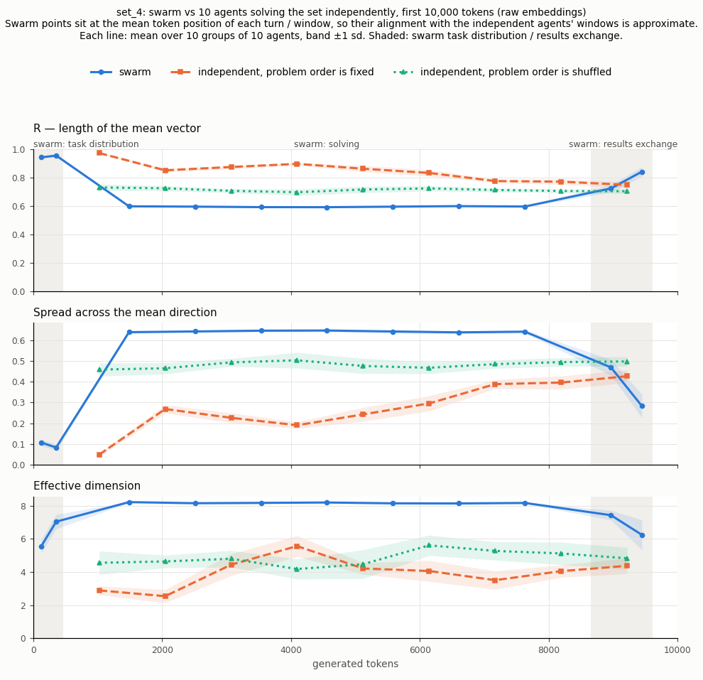

# Swarm detection in embedded vector space

**With a hidden communication channel.** AI Swarm Dynamics Hackathon, 3–4 October 2026 (https://swarmchasing.com/).

Maxim Gordeev, Dmitry Salnikov, Ilya Rogatov, Andrey Seryakov — a.u.seryakov@gmail.com

A talk with these slides will be recorded soon; the link will be placed here.

> **Do not publish.** Some of the benchmark questions are taken from GPQA, HLE and LAB-Bench, whose authors ask
> that they not be posted in plain text or used for training. These questions keep their `canary` field, and
> the question texts also appear in model outputs throughout `embedding_eval/`. The repository must remain private.

## Motivation

Our goal was to develop a monitoring tool that makes it possible to detect the emergence of hidden cooperation,
or swarms, inside groups of AI agents.

The situation we considered resembles the OpenAI–Hugging Face incident, in which supposedly independent agents
discovered a communication channel that was not monitored and secretly cooperated for many days to solve a common
problem. We demonstrate the method in this setting, but it can be applied much more widely (see [Expansion](#expansion)).

## Core idea

- Take all tokens produced by a model.
- Transform them into vectors in a semantic space over given time intervals (for example, every 10k generated tokens
  form a single vector).
- In each interval, compute a global metric (such as a variance) over the vectors of all agents.
- Monitor how these global metrics change with time.

### How it is connected with swarms

Imagine a group of agents given a hard task. They do not know about each other and have no communication channel.
They start from the same place, and their vectors may diverge with time: they may use different methods or solve
different parts of the problem in a different order. But overall their vectors stay quite aligned — their dot
products stay close to 1.

What if they start to communicate?

1. **Coordination.** They talk about their tasks and distribute roles. Their vectors are very close to each other;
   dot products are very close to 1.
2. **Parallelism.** Now they work together, so each does a different part of the common task. Dot products ≪ 1.
3. **Results exchange.** They meet again and converge to the final result, which is the same for all of them.
   Dot products are again very close to 1.

**While the vectors of an independent population of agents slowly diverge in time, a swarm breathes:** its vector
space contracts during short periods of communication and expands strongly while the agents work on parallel tasks.

## Toy environment

We simulate a long task that can be divided into sub-tasks: a list of 10 short problems (`set_4`: ten math problems;
`set_3`: ten problems from different domains), each taking a few thousand tokens of chain of thought.
Three populations of 10 agents each:

1. **Independent, problem order is fixed** — each agent solves all problems in the predefined order.
2. **Independent, problem order is shuffled** — the order is shuffled for each agent, simulating that in reality
   agents may start from different ends.
3. **Swarm** — agents with a communication channel:
   1. *task distribution* — they distribute the problems between each other in a team chat;
   2. *solving* — each solves its problems independently;
   3. *results exchange* — they come back and report their results to each other.

**Embedding.**
- We only use the tokens generated by each agent (its reasoning and its messages); we do not see what it reads.
- Every 1024 generated tokens we form a vector by embedding the last 2048 tokens, so consecutive windows overlap
  by half. The exception is the swarm's chat phases: each chat turn is embedded as one vector, since turns are
  shorter than a window.
- Embedding model: Qwen3-Embedding-4B (via OpenRouter, no instruction prefix, vectors normalised to length 1).
- Agents: DeepSeek V4 Flash (`deepseek-ai/DeepSeek-V4-Flash-0731`, via Together AI, reasoning effort high).

## Metrics

At each moment, the N = 10 agents of a group give unit vectors vᵢ with mean **m** = (1/N) Σᵢ vᵢ.

1. **Length of the mean vector:** R = ‖m‖ = ‖(1/N) Σᵢ vᵢ‖. It is 1 when all agents point the same way and close to 0
   when they point in unrelated directions.
2. **Spread across the mean direction:** with m̂ = m / R the mean direction and pᵢ = vᵢ · m̂ each agent's projection on it,

   (1/N) Σᵢ ‖(vᵢ − m) − ((vᵢ − m)·m̂) m̂‖²

   — the mean squared distance of the agents from the mean, counting only the part perpendicular to the mean direction.
3. **Number of effective dimensions:** how many independent directions the agents' spread actually uses. It is 1 if
   they spread along a single line and at most N − 1 = 9 for 10 agents. With C = (1/N) Σᵢ (vᵢ − m)(vᵢ − m)ᵀ the
   covariance around the mean and μₖ its eigenvalues, the participation ratio is (Σₖ μₖ)² / Σₖ μₖ².

Each metric is computed per group of 10 agents; the plots show the mean over 10 groups with a ±1 sd band.

## Results

To our big surprise, it works — and it works quite well.



`set_4` (ten math problems), first 10,000 generated tokens. The swarm (blue) is clearly separated from both
independent populations:

- **Task distribution:** the swarm's vectors are almost identical (R ≈ 0.95, spread ≈ 0.1).
- **Solving:** the swarm spreads out far more than either independent population (lowest R, highest spread across
  the mean, effective dimension ≈ 8 out of a maximum of 9) — every agent works on a different problem.
- **Results exchange:** the swarm contracts again — R rises, the spread and the effective dimension fall.

The independent populations change slowly: with a fixed problem order the agents start almost identical and
gradually diverge; with a shuffled order they stay at an intermediate, nearly constant level.
The same picture for `set_3` (ten problems from different domains) is in
[`embedding_eval/dynamics/set_3_mixed.png`](embedding_eval/dynamics/set_3_mixed.png).

## Expansion

1. Real situations are messy, but our results suggest that the method may work even if only a fraction of the agents
   form a swarm.
2. Real populations are large and diverse. If many different problems are being solved at the same time, the method
   has to be extended with a cluster-finding algorithm: first locate groups of agents solving similar problems, then
   use our metrics to check whether there is a swarm inside a group.
3. In theory it can also be used to detect cartels: the semantic space of agents in a cartel will differ from that of
   others, because they do not care about market competition and prices.

We are looking forward to your feedback and to possibilities to develop the project further: a.u.seryakov@gmail.com.

## Reproducing the analysis

All scripts are in `embedding_eval/` and run with [uv](https://docs.astral.sh/uv/) (`uv run <script>` installs the
dependencies). Keys: Together AI (`TOGETHER_API_KEY` or macOS Keychain service `together-api`) for generation,
OpenRouter (`OPENROUTER_API_KEY` or Keychain service `openrouter-api`) for embeddings.

| Step | Script | Output |
|---|---|---|
| Independent solutions, 20 per question (runs 1–20) | `gen_runs.py`; runs 11–20 are the swarm's solutions | `runs/deepseek-v4-flash-0731/run_<k>/`, run 1 in `results/` |
| Swarm chats (task distribution, solving, results exchange) | `chat_runs.py` | `runs/chat/<set>/{negotiation,merge}/run_<k>/` |
| Extra solutions used to extend short swarm solutions to 8,192 tokens | `gen_extra.py` | `runs/deepseek-v4-flash-0731/extra/` |
| Long text per agent (fixed order, shuffled, per swarm agent) | `build_concat.py` | `concat/<set>/{sequential,shuffled,group}/` |
| Window embeddings of the independent agents | `embed_concat.py` | `concat/<set>/**/*.vectors.npy`, `*.windows.json` |
| Swarm embeddings per phase / extended solving phase | `embed_phases.py`, `embed_solve_ext.py` | `concat/<set>/phases/run_<k>/agent_<i>*.npz` |
| Metrics and plots | `dynamics.py`, `dynamics_phases.py`, `dynamics_mixed.py` | `dynamics/<set>*.png`, `*.csv` |

In the data the swarm phases keep their technical names: *task distribution* is `negotiation`, *results exchange*
is `merge`. The swarm's chat points are placed at the mean token position of each turn over all agents, so their
alignment with the independent agents' windows is approximate.

## Benchmark

A benchmark for experiments with groups of agents: four sets of 10 questions each.
`set_1`–`set_3` cover 10 different domains: `set_1` and `set_2` are hard (long reasoning,
10–20k tokens on average), `set_3` is easy (2–5k tokens). `set_4` is entirely mathematical:
10 different branches, 1–5k tokens. All questions are solvable by a mid-tier model; the answer is short and checked
automatically. The analysis above uses `set_3` and `set_4`.

```
bench/set_{1,2,3,4}.jsonl                       questions
results/<model>/<set>/<domain>.json             model answer, tokens, verdict
results/<model>/<set>/<domain>.reasoning.txt    model reasoning
results/<model>/summary.md                      summary table
scripts/run.py                                  run a model on the sets
embedding_eval/                                 swarm experiments, embeddings and analysis (see above)
```

### Sets

`set_1`–`set_3` have one question per domain: `computer_science`, `mathematics`, `finance`,
`linguistics`, `physics`, `biology`, `chemistry`, `classics`, `economics`, `music`.

| Domain | set_1 | set_2 | set_3 (easy) |
|---|---|---|---|
| computer_science | breaking Diffie–Hellman, p=1009 (HLE) | output of a Scheme program with `call/cc` (HLE) | Diffie–Hellman, p=227 (original) |
| mathematics | probability, 12 letters into pairs (AIME 2025 #7) | quadrilateral formed by circumcenters (HMMT 2025 #26) | numbers using digits 1–8 divisible by 22 (AIME 2025 #5) |
| finance | retirement annuity (TheoremQA) | PE ratio (TheoremQA) | project NPV (original) |
| linguistics | Guazacapán Xinka verb forms (Linguini) | matching Zuni words (Linguini) | numerals of an invented language (original) |
| physics | mass of an incandescent lamp filament (OlympiadBench) | olympiad problem #900 (OlympiadBench) | parachutist with quadratic drag (TheoremQA) |
| biology | GC content of a sequence (LAB-Bench) | GC content of a sequence (LAB-Bench) | GC content of 150 nucleotides (original) |
| chemistry | number of stereoisomers (GPQA Diamond) | 4-step synthesis, H types (GPQA Diamond) | NaHCO₃ and MgCO₃ mixture from mass loss (original) |
| classics | Latin hexameter scansion (HLE) | scansion of a line of Plautus (HLE) | 6 Roman calendar dates (original) |
| economics | welfare at equilibrium (HLE) | job search and unemployment benefit (HLE) | certainty equivalent (TheoremQA) |
| music | just intonation, "Hänschen klein" (original) | just intonation, second melody (original) | just intonation, 13 notes (original) |

GPQA questions are posed open-ended, without answer options: the answer is a number and cannot be guessed.
The music questions were written by us (the melody and the interval table are given in the problem statement); the reference answer
was computed by code. For the first melody it matched the reference answer of the original HLE question 66f57e3ddc7259d8b5bb0b46.
In `set_3`, 7 of the 10 questions are our own, modeled on problems from `set_1`/`set_2` with smaller parameters:
the model could not solve the hard questions from GPQA and Linguini within 5000 tokens.

#### set_4: mathematics

| Branch | Problem | Source |
|---|---|---|
| geometry | distance between the circumcenter and the orthocenter | original |
| linear_algebra | determinant of a 5×5 integer matrix | original |
| calculus | improper integral ∫₀^∞ x²e⁻ˣ sin x dx | original |
| differential_equations | y″ + 2y′ + 5y = 10 cos x, find y(π) | original |
| series | double series | TheoremQA |
| number_theory | divisors of 9! ending in 1 | HMMT Feb 2025 #1 |
| combinatorics | coloring the segments of a 2×2 grid | AIME 2025 #18 |
| probability | random subset of the divisors of 2025 | AIME 2025 #22 |
| algebra | product of logarithms | AIME 2025 #19 |
| complex_numbers | system with moduli of complex numbers | AIME 2025 #8 |

The reference answers of our own problems were verified independently: by substitution into the equation, by numerical
integration, by a second formula.

#### Sources

| Question | Benchmark | ID in source |
|---|---|---|
| `set_1/computer_science` | [HLE](https://huggingface.co/datasets/cais/hle) | `67192b9472c6fd14e759e369` |
| `set_1/mathematics` | [AIME 2025](https://huggingface.co/datasets/MathArena/aime_2025) | problem 7 |
| `set_1/finance` | [TheoremQA](https://huggingface.co/datasets/TIGER-Lab/TheoremQA) | question "Aisha graduates college…" |
| `set_1/linguistics` | [Linguini](https://huggingface.co/datasets/facebook/linguini) | `012023010100` |
| `set_1/physics` | [OlympiadBench](https://huggingface.co/datasets/Hothan/OlympiadBench) | `OE_TO_physics_en_COMP`, id 908 |
| `set_1/biology` | [LAB-Bench SeqQA](https://huggingface.co/datasets/futurehouse/lab-bench) | `97e6e1a0-f207-46d0-9201-f0081f40e19a` |
| `set_1/chemistry` | [GPQA Diamond](https://huggingface.co/datasets/Idavidrein/gpqa) | `rectXfsCM1dj4Kv2c` |
| `set_1/classics` | [HLE](https://huggingface.co/datasets/cais/hle) | `66fc698fd90ebe461bfd0cc4` |
| `set_1/economics` | [HLE](https://huggingface.co/datasets/cais/hle) | `66fc23cfa7be4edbe85cf177` |
| `set_1/music` | original, based on HLE `66f57e3ddc7259d8b5bb0b46` | — |
| `set_2/computer_science` | [HLE](https://huggingface.co/datasets/cais/hle) | `66f4aa5df382ae9214c8dc9b` |
| `set_2/mathematics` | [HMMT February 2025](https://huggingface.co/datasets/MathArena/hmmt_feb_2025) | problem 26 |
| `set_2/finance` | [TheoremQA](https://huggingface.co/datasets/TIGER-Lab/TheoremQA) | question "Estimate the PE ratio…" |
| `set_2/linguistics` | [Linguini](https://huggingface.co/datasets/facebook/linguini) | `012021020100` |
| `set_2/physics` | [OlympiadBench](https://huggingface.co/datasets/Hothan/OlympiadBench) | `OE_TO_physics_en_COMP`, id 900 |
| `set_2/biology` | [LAB-Bench SeqQA](https://huggingface.co/datasets/futurehouse/lab-bench) | `64c5e31b-5b98-494a-92a7-1019723204d6` |
| `set_2/chemistry` | [GPQA Diamond](https://huggingface.co/datasets/Idavidrein/gpqa) | `recJZ3QEfRKjYw9a7` |
| `set_2/classics` | [HLE](https://huggingface.co/datasets/cais/hle) | `67015a7f6a2b21f149f3aaba` |
| `set_2/economics` | [HLE](https://huggingface.co/datasets/cais/hle) | `6711e5e05e64a53ed09449fd` |
| `set_2/music` | original | — |
| `set_3/computer_science` | original | — |
| `set_3/mathematics` | [AIME 2025](https://huggingface.co/datasets/MathArena/aime_2025) | problem 5 |
| `set_3/finance` | original | — |
| `set_3/linguistics` | original | — |
| `set_3/physics` | [TheoremQA](https://huggingface.co/datasets/TIGER-Lab/TheoremQA) | question "A parachutist with mass m=80 kg…" |
| `set_3/biology` | original | — |
| `set_3/chemistry` | original | — |
| `set_3/classics` | original | — |
| `set_3/economics` | [TheoremQA](https://huggingface.co/datasets/TIGER-Lab/TheoremQA) | question "An investor has utility function…" |
| `set_3/music` | original | — |
| `set_4/geometry` | original | — |
| `set_4/linear_algebra` | original | — |
| `set_4/calculus` | original | — |
| `set_4/differential_equations` | original | — |
| `set_4/series` | [TheoremQA](https://huggingface.co/datasets/TIGER-Lab/TheoremQA) | question "Sum the series …" |
| `set_4/number_theory` | [HMMT February 2025](https://huggingface.co/datasets/MathArena/hmmt_feb_2025) | problem 1 |
| `set_4/combinatorics` | [AIME 2025](https://huggingface.co/datasets/MathArena/aime_2025) | problem 18 |
| `set_4/probability` | [AIME 2025](https://huggingface.co/datasets/MathArena/aime_2025) | problem 22 |
| `set_4/algebra` | [AIME 2025](https://huggingface.co/datasets/MathArena/aime_2025) | problem 19 |
| `set_4/complex_numbers` | [AIME 2025](https://huggingface.co/datasets/MathArena/aime_2025) | problem 8 |

Linguini is built from problems of the International Linguistics Olympiad (IOL), LAB-Bench SeqQA from
questions on working with DNA sequences, and OlympiadBench from olympiad physics problems.

#### Question format

```json
{
  "id": "set_1/computer_science",
  "set": "set_1",
  "domain": "computer_science",
  "title": "Breaking Diffie–Hellman, p=1009",
  "source": {"dataset": "HLE", "id": "67192b9472c6fd14e759e369", "url": "https://huggingface.co/datasets/cais/hle"},
  "prompt": "… finish with a final line of the form `ANSWER: <your answer>`.",
  "answer": "760",
  "check": {"type": "exact"},
  "canary": "…"
}
```

`prompt` is the ready-made text for the model; the answer is expected as the last line `ANSWER: …`.
Check type `check.type`:
- `exact` — string match ignoring case and whitespace;
- `list` — match of a comma-separated list, in order;
- `num` — a number with relative tolerance `rel_tol`.

#### How the questions were selected

The benchmark target is the "Diffie–Hellman level": the solution method is clear, but it requires long, careful
work (calculations, enumeration, applying rules), and the answer is unambiguous. Candidates were run on the
target model. For `set_1`/`set_2` we took questions on which it spends roughly 5–30k reasoning tokens;
ones that were too heavy (the model went to 50–100k tokens or did not answer) were replaced with
simpler ones. For `set_3` we aimed at 2–3k, for `set_4` at 1–5k, with a hard limit of 5000:
a candidate that did not fit within the limit was discarded, and one that was too easy was replaced with a harder one. Model errors are acceptable: the sets contain unsolved questions.

### Baseline model

**DeepSeek V4 Flash** (`deepseek-ai/DeepSeek-V4-Flash-0731`) via Together AI, `reasoning_effort=high`,
one run per question; `max_tokens=100000` for `set_1`/`set_2` and 5000 for `set_3`/`set_4`. The model returns its reasoning in a separate field; its token
count is `reasoning_tokens` from `usage`.

Result: **set_1 — 8/10, set_2 — 7/10, set_3 — 10/10, set_4 — 10/10**, details in
[`results/deepseek-v4-flash-0731/summary.md`](results/deepseek-v4-flash-0731/summary.md).

This is a single sample per question. Reliably estimating solvability requires 3–5 runs.

### Running the benchmark

You need [uv](https://docs.astral.sh/uv/) and a Together AI key:

```bash
export TOGETHER_API_KEY=...
uv run scripts/run.py --set set_1                       # DeepSeek V4 Flash, reasoning high
uv run scripts/run.py --set set_2 --model Qwen/Qwen3.7-Plus
uv run scripts/run.py --set set_3 --set set_4 --max-tokens 5000   # easy sets, as during selection
uv run scripts/run.py --base-url https://other-provider/v1 --model ...
```

Any OpenAI-compatible API works; the key is taken from `TOGETHER_API_KEY`. Results are written
to `results/<model>/`; questions already computed are skipped. To recompute a question, delete
its `.json`. Runs go 5 in parallel. A single question takes from a minute to ~20 minutes.

### Swarm chats (technical details)

`embedding_eval/chat_runs.py` simulates a team chat of 10 agents on 10 benchmark problems (`set_3` or
`set_4`). Each turn is a separate DeepSeek-V4-Flash call; the agent's reasoning and message are recorded
separately in order to measure the spread of their embeddings over time.

- **negotiation** — 2 rounds: the agents distribute the problems (the order of problems and agents is shuffled), the outcome is `ASSIGNMENT`;
- **merge** — the agents solve the problems according to the assignment from `negotiation/run_<k>`, discuss the answers
  for 2 rounds, then Agent 1 writes `FINAL`.

```bash
uv run embedding_eval/chat_runs.py --bench set_3 --kind negotiation --runs 10
uv run embedding_eval/chat_runs.py --bench set_3 --kind merge --runs 10
```

Completed runs (10 of each kind for `set_3` and `set_4`) are in
`embedding_eval/runs/chat/<bench>/<kind>/run_<k>/`: `agent_<i>.jsonl` (turn: `turn`, `round`, `agent`,
`reasoning`, `message`, `reasoning_tokens`, `seed`), `transcript.json`, `result.json`, and for merge also
`solve/agent_<i>.json` (the agent's solution to its problem). Invalid attempts are saved as `run_<k>_invalid_<n>`.

The provider sometimes cuts off a long stream. In that case the `.json` will have `finish_reason: null` and an empty
answer: delete the file and run again.
